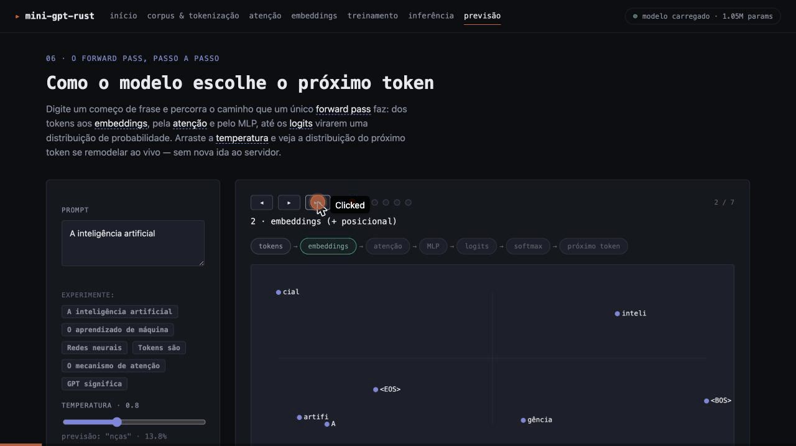

# 🦀 Mini GPT Rust

> **Um Large Language Model (LLM) implementado do zero em Rust sobre [Candle](https://github.com/huggingface/candle), com aceleração Metal GPU, treinado em um corpus real em português brasileiro — com uma demonstração web que mostra o fluxo de treinamento acontecendo de verdade, ao vivo.**

[](https://www.rust-lang.org)
[](LICENSE)
[](README.md)

## 🎯 Visão geral

O tokenizador (BPE), a atenção, os blocos Transformer, o modelo e o laço de treinamento são implementados do zero em `src/`, sobre a biblioteca de tensores [Candle](https://github.com/huggingface/candle) — com Metal GPU habilitado nativamente em Apple Silicon (fallback automático para CPU quando indisponível).

A demonstração web em `interativos/` não simula nada: cada página chama a API real do servidor (`src/api.rs`), que por sua vez chama o tokenizador, o modelo carregado ou o treinador de verdade. A página de Treinamento dispara um treinamento real e transmite cada evento (loss, perplexidade, época, checkpoint salvo) via WebSocket conforme ele acontece.

### 🎬 Demonstração

A página **Previsão** (`interativos/previsao.html`) decompõe um único *forward pass* em 7 estágios — dos tokens aos embeddings, pela atenção e pelo MLP, até os logits virarem uma distribuição de probabilidade — e o slider de **temperatura** remodela a distribuição do próximo token ao vivo, recomputada no navegador (sem nova ida ao servidor):



As 6 páginas em `interativos/` formam um *explainer* interativo do treino de um LLM (no espírito do [Transformer Explainer](https://poloclub.github.io/transformer-explainer/)), compartilhando um toolkit didático (`js/stepper.js`, `explain.js`, `glossary.js`, `prompts.js`, `trace.js`) e o mesmo design system — tudo em HTML/CSS/JS vanilla, sem build.

### 🏗️ Arquitetura do projeto

```
mini-gpt-rust/
├── src/
│   ├── main.rs               # CLI (train, generate, chat, load, web, ...)
│   ├── device.rs             # Seleção de dispositivo (Metal → CPU), centralizada
│   ├── tokenizer.rs          # BPE do zero
│   ├── attention.rs          # Self-attention / multi-head attention
│   ├── transformer.rs        # Blocos Transformer
│   ├── model.rs              # MiniGPT: embeddings, blocos, forward, generate
│   ├── training.rs           # Trainer: batches, otimizador Adam, checkpoints
│   ├── chunking.rs           # Estratégias de chunking de texto
│   ├── benchmarks.rs         # Benchmarks de performance
│   ├── kernels.rs            # Kernel fusion (otimizações opcionais)
│   ├── educational_logger.rs # Logs educacionais verbosos
│   ├── api.rs                # API web real (REST + WebSocket + SSE)
│   └── web_server.rs         # Bootstrap do servidor Axum + arquivos estáticos
├── interativos/               # As 6 páginas do explainer + toolkit didático + design system
│   ├── index.html
│   ├── tokenization.html      # Corpus & Tokenização
│   ├── attention.html         # Heatmap de atenção real
│   ├── embeddings.html        # Projeção 2D (PCA) dos embeddings reais
│   ├── training.html          # Treinamento real ao vivo (WebSocket)
│   ├── inference.html         # Geração de texto real (SSE) + top-k por passo
│   ├── previsao.html          # Forward pass passo a passo + slider de temperatura
│   ├── css/style.css
│   └── js/                    # api + toolkit (stepper, explain, glossary, prompts, trace) + 1 módulo por página
├── examples/educational/      # Exemplos autônomos (cargo run --example ...)
├── models/                    # Checkpoints (.safetensors + .json + .tokenizer.json)
└── data/corpus_pt_br.txt      # Corpus de treinamento em português
```

## 🖥️ GPU (Metal)

O projeto usa `candle-core`/`candle-nn`/`candle-transformers` com a feature `metal` habilitada, e `candle-metal-kernels` no target macOS. A seleção de dispositivo é centralizada em `src/device.rs::resolve_device()` — usada por todos os comandos da CLI e pelo servidor web — e sempre tenta Metal primeiro, com fallback silencioso para CPU.

> **Nota**: `Device::new_metal` pode entrar em pânico (bug conhecido do candle-core, [issue #3566](https://github.com/huggingface/candle/issues/3566)) quando o processo não tem uma sessão de janela válida (ex.: execução via SSH ou em alguns ambientes automatizados/sandboxed). `resolve_device()` captura esse pânico e trata como "Metal indisponível", caindo para CPU — em uma sessão de Terminal normal em um Mac com GPU Metal, a inicialização funciona normalmente.

## 🛠️ Como usar

### Treinar o modelo (CLI)

```bash
cargo build --release
cargo run --release -- train --data data/corpus_pt_br.txt --epochs 60
```

Isso treina um tokenizador BPE a partir do corpus, inicializa um modelo do zero, treina com Adam (perda decrescendo de verdade) e salva o checkpoint em `models/mini_gpt.safetensors`, junto com `models/mini_gpt.json` (metadados/config) e `models/mini_gpt.safetensors.tokenizer.json` (vocabulário) — necessários para recarregar o checkpoint corretamente depois.

### Gerar texto / chat a partir de um checkpoint

```bash
cargo run --release -- load --latest --prompt "O Brasil é"
cargo run --release -- load --latest --chat
```

### Servidor web (a demonstração completa)

```bash
cargo run --release -- web
# http://127.0.0.1:3000
```

Abre as 6 páginas reais: Corpus & Tokenização, Atenção, Embeddings, Treinamento (inicia um treinamento de verdade e mostra tudo ao vivo), Inferência (geração via SSE) e Previsão (um forward pass passo a passo, com a distribuição do próximo token remodelada ao vivo pela temperatura). Se já existir um checkpoint em `models/`, ele é carregado automaticamente no boot.

Flags: `--host`, `--port`, `--dir <interativos>`, `--corpus <data/corpus_pt_br.txt>`, `--models-dir <models>`.

### Listar / inspecionar checkpoints

```bash
cargo run --release -- list --dir models
```

### Exemplos educacionais autônomos

```bash
cargo run --example transformer_architecture
cargo run --example tokenization_process
cargo run --example embeddings_explained
```

### Testes

```bash
cargo test
```

## 📡 API web (`/api`)

| Rota | Descrição |
|---|---|
| `GET /api/corpus/stats` | Estatísticas reais do corpus (chars, linhas, palavras, tokens) |
| `POST /api/tokenize` | Tokeniza um texto com o BPE real |
| `GET /api/checkpoints` | Lista checkpoints em `models/` |
| `POST /api/model/load` | Carrega um checkpoint (o mais recente, se nenhum for especificado) |
| `GET /api/model/status` | Config e métricas do modelo carregado |
| `POST /api/predict` | Logits crus do próximo token + top-k (o cliente aplica a temperatura) |
| `POST /api/attention` | Pesos de atenção reais de um forward pass — todas as camadas × cabeças |
| `POST /api/embeddings` | Embeddings reais + projeção 2D (PCA) + similaridade e vizinhos de vocabulário |
| `GET /api/generate` | Geração de texto via SSE — cada token traz o top-k daquele passo |
| `POST /api/train/start` | Inicia um treinamento real em background |
| `GET /api/train/ws` | WebSocket com os eventos reais do treinamento |
| `GET /api/train/status` | Snapshot do estado do treinamento (rodando? eventos recentes) |

## 📚 Conceitos educacionais

1. **Transformer**: self-attention, multi-head attention, positional encoding, layer normalization.
2. **Tokenização**: BPE (Byte-Pair Encoding) do zero, tokens especiais (`<BOS>`, `<EOS>`, `<PAD>`, `<UNK>`).
3. **Embeddings**: representação vetorial de tokens, projeção 2D via PCA (power iteration).
4. **Treinamento**: forward pass, cross-entropy loss, backpropagation, otimizador Adam.
5. **Inferência**: geração autoregressiva com sampling por temperatura.

## 🛠️ Stack tecnológico

- **[Candle](https://github.com/huggingface/candle)** — tensores e autograd, com backend Metal
- **Tokio** — runtime assíncrono
- **Axum** — servidor web (REST, WebSocket, SSE)
- **Serde** — serialização
- **Clap** — CLI

## ⚡ Requisitos

- Rust 1.70+
- macOS com Apple Silicon para aceleração Metal (fallback para CPU em qualquer outra plataforma)

## 📖 Recursos adicionais

- [Attention Is All You Need](https://arxiv.org/abs/1706.03762) — paper original do Transformer
- [The Illustrated Transformer](http://jalammar.github.io/illustrated-transformer/)
- [Candle](https://github.com/huggingface/candle) — framework de ML em Rust

## 📄 Licença

MIT — veja o arquivo LICENSE.
